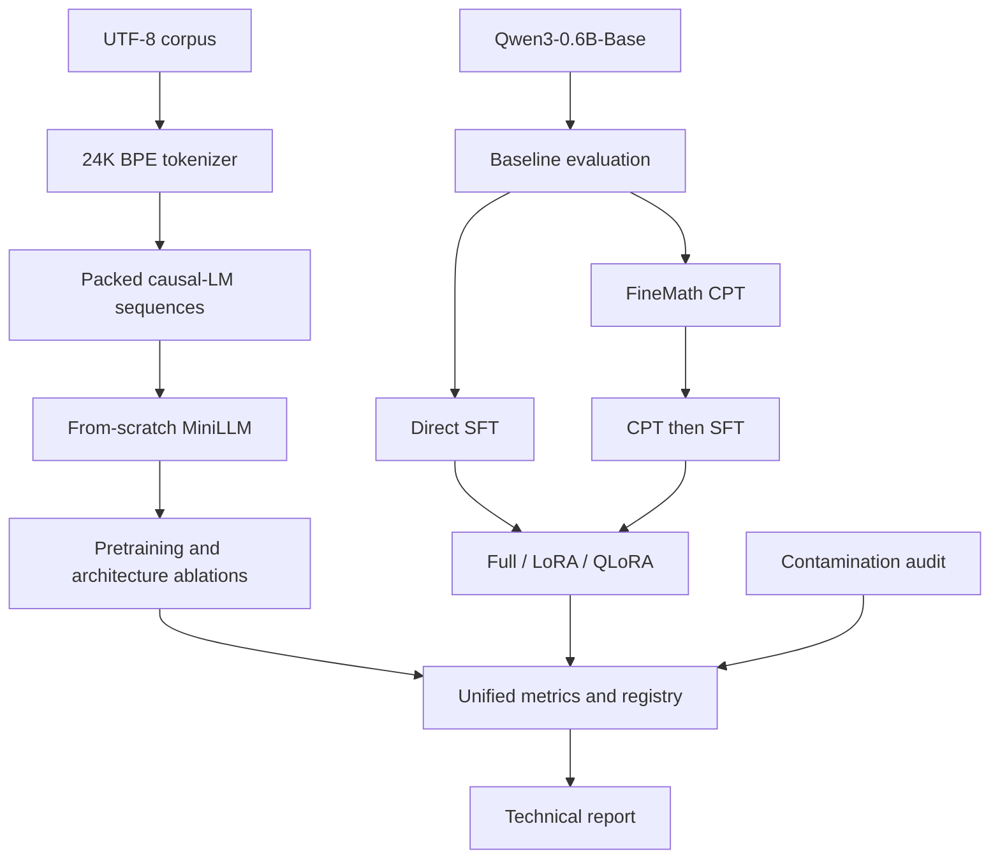

# MiniLLM-Forge

**Transformer Pretraining & LLM Fine-tuning Laboratory**

MiniLLM-Forge is a reproducible training portfolio project for mathematical reasoning. It
contains a decoder-only Transformer implemented directly in PyTorch and a separate
Qwen3-0.6B-Base pipeline for continued pretraining (CPT), full SFT, LoRA, and QLoRA.
The project is an experiment laboratory, not a chat application or inference service.

> MiniLLM uses a deliberately limited corpus to validate the complete Transformer
> training mechanism and controlled architecture/optimization experiments. It does not
> claim compute-optimal or fully converged pretraining.

## What Is Implemented

- From-scratch RMSNorm, RoPE, causal attention, GQA/MHA, SwiGLU, Transformer blocks,
  tied embeddings, and next-token label shifting
- 24K byte-level BPE training, normalization, round-trip checks, and token statistics
- Text/JSONL ingestion, fixed-length packing, exact deduplication, n-gram benchmark
  collision auditing, and versioned manifest helpers
- Explicit PyTorch loop with AdamW, warmup/cosine decay, gradient accumulation,
  clipping, FP32/FP16/BF16 AMP, gradient checkpointing, numerical checks, evaluation,
  OOM records, JSONL metrics, and full-state checkpoint/resume
- Qwen Base CPT and assistant-only Full SFT, LoRA, and NF4 double-quantized QLoRA
- Perplexity, mathematical exact match, parameters, throughput, elapsed time, and actual
  peak CUDA memory measurement
- A 15-experiment controlled matrix, automatic CSV registration, fixed held-out math
  evaluation set, failure template, and technical report structure

No benchmark score or GPU metric is fabricated in this repository. Result cells remain
`TBD` until the corresponding pinned run has completed.

## Architecture



Each MiniLLM block is pre-norm:

```text
x -> RMSNorm -> RoPE GQA causal attention -> residual
  -> RMSNorm -> SwiGLU -> residual
```

The default configuration is approximately 35M-40M parameters: 512 hidden dimensions,
8 layers, 8 query heads, 4 key/value heads, a 1536-wide MLP, and a 24K vocabulary.

## Install

Python 3.10+ is required. Choose exactly one hardware path; uv keeps the environment and
cache inside the repository when `UV_CACHE_DIR` is set as shown.

CPU development and unit tests:

```powershell
$env:UV_CACHE_DIR = Join-Path (Get-Location) '.uv-cache'
uv sync --extra dev --extra cpu
uv run pytest
```

NVIDIA CUDA training (official PyTorch cu128 wheel):

```powershell
$env:UV_CACHE_DIR = Join-Path (Get-Location) '.uv-cache'
uv sync --extra dev --extra cuda
uv run minillm-qualify-gpu
```

QLoRA selects the same cu128 torch build and adds the qualified bitsandbytes backend:

```powershell
$env:UV_CACHE_DIR = Join-Path (Get-Location) '.uv-cache'
uv sync --extra dev --extra qlora
```

The CPU extra conflicts with CUDA and QLoRA by design. Do not run a hardware workflow
without selecting its explicit extra. `requirements-cpu.lock`, `requirements-cuda.lock`,
and `requirements.lock` (QLoRA) are exported from the same `uv.lock` resolution.

Blackwell RTX 50-series GPUs require a PyTorch CUDA build with CUDA runtime 12.8 or
newer. The locally qualified combination is torch 2.11.0+cu128 on an RTX 5060 Laptop GPU
(8151 MiB, compute capability 12.0) with driver 577.02. This is a measured configuration,
not the only supported configuration. CUDA 13.x was not selected because NVIDIA requires
a 580+ driver for that runtime family.

### GPU-0 Qualification

The bounded qualification commands do not run a formal training campaign:

```powershell
uv run minillm-pretrain --config configs/pretrain/gpu_smoke.yaml
uv run minillm-qualify-qwen --mode base --sequence-length 1024 `
  --output artifacts/environment/qwen_base_1024.json
uv run minillm-qualify-qwen --mode lora --sequence-length 1024 `
  --output artifacts/environment/qwen_lora_1024.json
uv run minillm-qualify-qwen --mode qlora --sequence-length 1024 `
  --output artifacts/environment/qwen_qlora_1024.json
```

Set `HF_HOME` and `HF_HUB_CACHE` under the repository before downloading models when
strict workspace-local caching is required. Full evidence and the 8GB decision are in
`reports/GPU_ENVIRONMENT_QUALIFICATION.md`.

## Phase A: From Scratch

Run the fast CPU-compatible model tests and Tiny Overfit gate:

```powershell
uv run pytest
uv run minillm-pretrain --config configs/pretrain/smoke.yaml
uv run minillm-plot --metrics runs/tiny-overfit-verified/metrics.jsonl `
  --output reports/figures/tiny-overfit.png
```

Train a tokenizer from line-oriented UTF-8 corpus files:

```powershell
uv run minillm-prepare-corpus `
  --revision 87f09149ef4734204d70ed1d046ddc9ca3f2b8f9 `
  --max-documents 100000 `
  --output data/processed/fineweb_edu_train.txt
uv run minillm-tokenizer data/processed/fineweb_edu_train.txt `
  --output artifacts/tokenizers/minillm-tokenizer.json `
  --vocab-size 24000
```

For an exact formal token budget, rerun corpus preparation with `--tokenizer` and
`--target-tokens` after the tokenizer is trained. This writes the pinned data manifest.

After placing a pinned, audited corpus at the path in `configs/pretrain/formal.yaml`:

```powershell
uv run minillm-experiment --config configs/pretrain/formal.yaml --id E01
```

The formal run must not start unless unit tests, Tiny Overfit, and finite-gradient checks
pass. The MHA and no-RoPE controls are in `configs/pretrain/`.

## Phase B: Qwen CPT and SFT

Freeze the baseline before any training:

```powershell
uv run minillm-evaluate `
  --model Qwen/Qwen3-0.6B-Base `
  --revision da87bfb608c14b7cf20ba1ce41287e8de496c0cd `
  --mode math `
  --data data/eval/controlled_math.jsonl `
  --dataset-version controlled-math-v1 `
  --output artifacts/eval_manifests/qwen3-base-controlled.json
```

Then run CPT and SFT independently:

```powershell
uv run minillm-prepare-sft `
  --revision e4e141ec9dea9f8326f4d347be56105859b2bd68 `
  --tokenizer-revision da87bfb608c14b7cf20ba1ce41287e8de496c0cd
uv run minillm-experiment --config configs/cpt/qwen3_math.yaml --id E04
uv run minillm-experiment --config configs/sft/qwen3_full.yaml --id E05
uv run minillm-experiment --config configs/sft/qwen3_lora.yaml --id E09
uv sync --extra qlora
uv run minillm-experiment --config configs/sft/qwen3_qlora.yaml --id E11
```

SFT labels are constructed before collation. System, user, and padding tokens receive
`-100`; only assistant tokens contribute to causal loss. The behavior is covered by an
independent test.

## Data Contract

Raw and processed training data are intentionally excluded from version control. Local
SFT JSONL uses this schema:

```json
{"problem": "Solve 2x + 4 = 10.", "solution": "...\nFinal answer: 3"}
```

Before training, pin the upstream revision, filter malformed/incomplete solutions,
deduplicate normalized text, remove any benchmark collisions, and write a manifest.
Audit a prepared set against the held-out set with:

```powershell
uv run minillm-audit `
  --train data/processed/openr1_math_sft.jsonl `
  --benchmark data/eval/controlled_math.jsonl `
  --output artifacts/data_manifests/contamination_report.json
```

Public GSM8K, SVAMP, ASDiv, and MATH-500 scores must be reported separately from the
repository's controlled held-out set because public benchmark contamination cannot be
ruled out from model pretraining history alone.

## Checkpoint and Resume

Each checkpoint contains model, optimizer, scheduler, AMP scaler, global step, epoch,
batches/tokens seen, metric history, Python/NumPy/PyTorch/CUDA RNG states, and the run
configuration. Checkpoints are written atomically.

```powershell
uv run minillm-pretrain `
  --config configs/pretrain/formal.yaml `
  --resume runs/E01-minillm-baseline/step-00000500.pt
```

For strict continuous-vs-resumed comparisons, keep loader ordering, seed, hardware,
software lock, and dataset manifest identical.

## Experiment Protocol

The bounded matrix is in `experiments/matrix.yaml`. Each run must state a hypothesis,
controlled variables, one independent variable, metrics, interpretation, and one of
`supported`, `partially-supported`, or `rejected`. Runs append environment and config
metadata to `experiments/registry.csv`.

The central comparisons are GQA/MHA, RoPE/no-RoPE, learning rate, warmup, CPT/direct
SFT/CPT-to-SFT, LoRA rank 4/8/16/32, adapter placement, LoRA/QLoRA, and repeated seeds.

| Model | Method | Trainable params | Peak VRAM | Math EM | Tokens/s | Status |
| --- | --- | ---: | ---: | ---: | ---: | --- |
| Qwen Base | zero-shot | - | TBD | TBD | - | pending GPU run |
| MiniLLM | pretrain | TBD | TBD | TBD | TBD | smoke gate only |
| Qwen | CPT | TBD | TBD | TBD | TBD | pending GPU run |
| Qwen | LoRA SFT | TBD | TBD | TBD | TBD | pending GPU run |
| Qwen | QLoRA SFT | TBD | TBD | TBD | TBD | pending CUDA run |

## Repository Map

```text
configs/                 model and controlled-run YAML
data/eval/               immutable held-out examples
src/minillm_forge/model  hand-written Transformer
src/minillm_forge/data   packing, SFT masking, governance
src/minillm_forge/training explicit trainer and checkpointing
src/minillm_forge/finetuning Full SFT, LoRA, QLoRA
src/minillm_forge/evaluation PPL, exact match, efficiency
scripts/                 direct Python wrappers
tests/                   architecture and training gates
experiments/             matrix, registry, measured outputs
reports/                 ablations, failures, final report
artifacts/               data/evaluation manifests
```

## Definition of Done

Code-complete means the paths and tests exist. Portfolio-complete additionally requires
real training evidence. The current repository deliberately distinguishes them:

| Gate | Evidence | Current state |
| --- | --- | --- |
| Transformer unit tests | `tests/` | implemented; see latest test run |
| Tiny overfit | `runs/tiny-overfit-verified/summary.json` | passed locally; see generated summary |
| Checkpoint resume | checkpoint tests and interrupted run | unit path implemented |
| Baseline, CPT, SFT, LoRA, QLoRA | eval/run manifests | pending real GPU runs |
| 10+ controlled experiments | registry plus reports | matrix defined; results pending |
| Contamination audit | JSON report | command implemented; corpus audit pending |
| Final technical report | `reports/FINAL_REPORT.md` | honest implementation report/template |

See `reports/FINAL_REPORT.md` for assumptions, expected evidence, and limitations.
